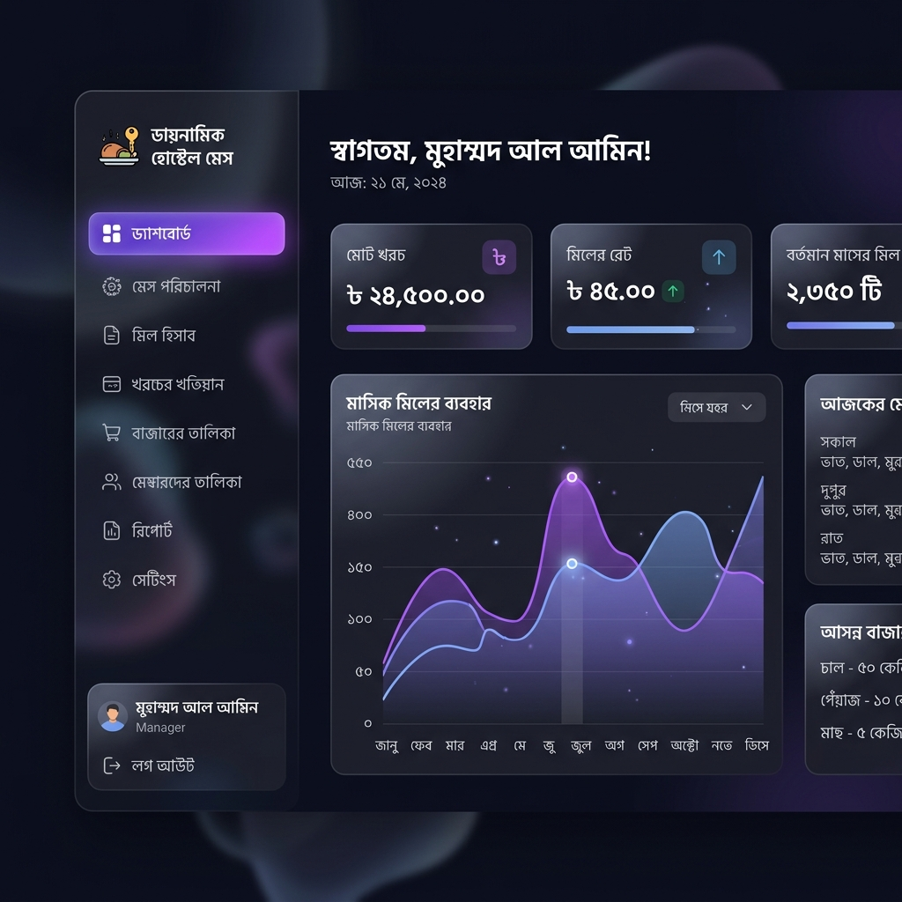
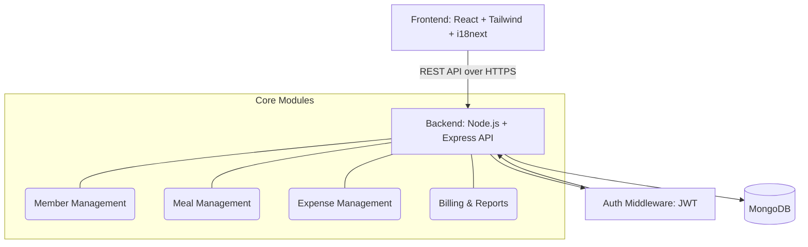

# Mess Management System (মেস ম্যানেজমেন্ট সিস্টেম) - Architecture & System Design



This document outlines the system design, database architecture, API specifications, and code structure for the Mess Management System, tailored for a primary Bangla interface with full i18n support.

## 1. System Design Architecture



## 2. Directory Structure

A clean, scalable folder structure separating frontend and backend.

```text
mess-management-system/
├── frontend/                 # React Application
│   ├── public/
│   │   └── locales/          # i18n Translation files
│   │       ├── bn/
│   │       │   └── translation.json
│   │       └── en/
│   │           └── translation.json
│   ├── src/
│   │   ├── components/       # Reusable UI components (Buttons, Modals)
│   │   ├── pages/            # Page components (Dashboard, Meals, Billing)
│   │   ├── services/         # API call wrappers (Axios)
│   │   ├── hooks/            # Custom React hooks
│   │   ├── context/          # State management (AuthContext, etc.)
│   │   ├── utils/            # Helper functions (Formatting, etc.)
│   │   ├── i18n.js           # i18next configuration
│   │   └── App.js
└── backend/                  # Node.js + Express Application
    ├── src/
    │   ├── config/           # DB connection, Env vars
    │   ├── models/           # Mongoose schemas
    │   ├── controllers/      # Request handlers/Business logic
    │   ├── routes/           # Express route definitions
    │   ├── middlewares/      # auth, error handling, validation
    │   ├── services/         # Complex business logic (Billing, Aggregations)
    │   └── utils/            # Helper functions
    ├── .env
    └── server.js
```

---

## 3. MongoDB Schema Design & Mongoose Models

### User / Member Model
Stores authentication data and member details.
```javascript
// backend/src/models/User.js
const mongoose = require('mongoose');

const userSchema = new mongoose.Schema({
  name: { type: String, required: true },
  phone: { type: String, required: true, unique: true },
  password: { type: String, required: true },
  role: { type: String, enum: ['admin', 'member'], default: 'member' },
  canInputMeals: { type: Boolean, default: false }, // If manager gives access
  roomNumber: { type: String },
  joinDate: { type: Date, default: Date.now },
  isActive: { type: Boolean, default: true },
  advancedPayment: { type: Number, default: 0 } // অগ্রিম জমা
}, { timestamps: true });

userSchema.index({ phone: 1 });
module.exports = mongoose.model('User', userSchema);
```

### Meal Model
Tracks daily meals per member.
```javascript
// backend/src/models/Meal.js
const mongoose = require('mongoose');

const mealSchema = new mongoose.Schema({
  user: { type: mongoose.Schema.Types.ObjectId, ref: 'User', required: true },
  date: { type: Date, required: true },
  breakfast: { type: Number, default: 0 },
  lunch: { type: Number, default: 0 },
  dinner: { type: Number, default: 0 },
  totalMeals: { type: Number, default: 0 } // Computed: breakfast + lunch + dinner
}, { timestamps: true });

mealSchema.index({ date: 1, user: 1 }, { unique: true }); // One record per user per day
module.exports = mongoose.model('Meal', mealSchema);
```

### Expense Model
Tracks all mess expenses.
```javascript
// backend/src/models/Expense.js
const mongoose = require('mongoose');

const expenseSchema = new mongoose.Schema({
  addedBy: { type: mongoose.Schema.Types.ObjectId, ref: 'User', required: true },
  date: { type: Date, default: Date.now },
  amount: { type: Number, required: true },
  category: { type: String, enum: ['বাজার', 'গ্যাস', 'বেতন', 'অন্যান্য'], required: true },
  description: { type: String }
}, { timestamps: true });

expenseSchema.index({ date: 1 });
module.exports = mongoose.model('Expense', expenseSchema);
```

### Payment Model
Tracks monthly bill payments.
```javascript
// backend/src/models/Payment.js
const mongoose = require('mongoose');

const paymentSchema = new mongoose.Schema({
  user: { type: mongoose.Schema.Types.ObjectId, ref: 'User', required: true },
  month: { type: Number, required: true }, // 1-12
  year: { type: Number, required: true },
  totalBill: { type: Number, required: true },
  paidAmount: { type: Number, default: 0 },
  status: { type: String, enum: ['পরিশোধিত', 'বাকি'], default: 'বাকি' },
  paymentDate: { type: Date }
}, { timestamps: true });

paymentSchema.index({ user: 1, month: 1, year: 1 }, { unique: true });
module.exports = mongoose.model('Payment', paymentSchema);
```

---

## 4. API Design (RESTful)

### Auth & Members
- `POST /api/auth/login` - Login and get JWT
- `POST /api/users` - Add new member (Admin only)
- `GET /api/users` - List all members
- `PUT /api/users/:id` - Update member details

### Meals
- `POST /api/meals` - Add/Update daily meal for a user
- `GET /api/meals` - Get meals (filter by date, month, user)

### Expenses
- `POST /api/expenses` - Add new expense
- `GET /api/expenses` - Get expenses by month

### Billing & Reports
- `GET /api/reports/monthly-summary?month=M&year=Y` - Get overall mess summary (Total meals, total cost, meal rate)
- `GET /api/reports/user-bill/:userId?month=M&year=Y` - Get specific user's monthly bill
- `POST /api/payments` - Record a payment

---

## 5. Aggregation Pipelines

### Calculate Meal Rate & Monthly Summary
To find the meal rate, we need Total Expenses / Total Meals.

```javascript
// backend/src/services/reportService.js
const getMonthlySummary = async (startDate, endDate) => {
  // 1. Get Total Expenses
  const expenseResult = await Expense.aggregate([
    { $match: { date: { $gte: startDate, $lte: endDate } } },
    { $group: { _id: null, totalExpense: { $sum: '$amount' } } }
  ]);
  const totalCost = expenseResult.length > 0 ? expenseResult[0].totalExpense : 0;

  // 2. Get Total Meals
  const mealResult = await Meal.aggregate([
    { $match: { date: { $gte: startDate, $lte: endDate } } },
    { $group: { _id: null, totalMeals: { $sum: '$totalMeals' } } }
  ]);
  const totalMealsCount = mealResult.length > 0 ? mealResult[0].totalMeals : 0;

  // 3. Calculate Meal Rate
  const mealRate = totalMealsCount > 0 ? totalCost / totalMealsCount : 0;

  return { totalCost, totalMealsCount, mealRate };
};
```

### User Monthly Bill Pipeline
```javascript
const getUserMonthlyBill = async (userId, startDate, endDate, mealRate) => {
  const userMeals = await Meal.aggregate([
    { $match: { user: mongoose.Types.ObjectId(userId), date: { $gte: startDate, $lte: endDate } } },
    { $group: { _id: '$user', totalMeals: { $sum: '$totalMeals' } } }
  ]);
  
  const totalUserMeals = userMeals.length > 0 ? userMeals[0].totalMeals : 0;
  const foodCost = totalUserMeals * mealRate;
  
  return { totalMeals: totalUserMeals, foodCost, mealRate };
};
```

---

## 6. Sample Code Snippets

### Add/Update Meal Controller
```javascript
// backend/src/controllers/mealController.js
exports.addOrUpdateMeal = async (req, res) => {
  try {
    const { userId, date, breakfast, lunch, dinner } = req.body;
    const totalMeals = breakfast + lunch + dinner;

    // Use upsert to handle both adding a new daily record or updating an existing one
    const meal = await Meal.findOneAndUpdate(
      { user: userId, date: new Date(date) },
      { breakfast, lunch, dinner, totalMeals },
      { new: true, upsert: true, runValidators: true }
    );

    res.status(200).json({ success: true, data: meal, message: 'মিল সফলভাবে সেভ হয়েছে' });
  } catch (error) {
    res.status(500).json({ success: false, error: error.message });
  }
};
```

---

## 7. i18n Bangla Setup

### `frontend/public/locales/bn/translation.json`
```json
{
  "common": {
    "save": "সংরক্ষণ করুন",
    "cancel": "বাতিল",
    "delete": "মুছে ফেলুন",
    "edit": "সম্পাদনা",
    "logout": "লগআউট"
  },
  "sidebar": {
    "dashboard": "ড্যাশবোর্ড",
    "members": "সদস্য ব্যবস্থাপনা",
    "meals": "মিল ব্যবস্থাপনা",
    "expenses": "খরচ ব্যবস্থাপনা",
    "billing": "মাসিক বিল"
  },
  "members": {
    "title": "সদস্য তালিকা",
    "add_member": "নতুন সদস্য যোগ করুন",
    "name": "নাম",
    "phone": "ফোন নম্বর",
    "room": "রুম নম্বর",
    "join_date": "যোগদানের তারিখ",
    "status": "অবস্থা",
    "active": "সক্রিয়",
    "inactive": "নিষ্ক্রিয়"
  },
  "meals": {
    "title": "মিল রেকর্ড",
    "date": "তারিখ",
    "breakfast": "সকাল",
    "lunch": "দুপুর",
    "dinner": "রাত",
    "total": "মোট মিল"
  },
  "expenses": {
    "title": "মাসিক খরচ",
    "add_expense": "খরচ যোগ করুন",
    "amount": "পরিমাণ (৳)",
    "category": "ক্যাটাগরি",
    "grocery": "বাজার",
    "gas": "গ্যাস",
    "salary": "বেতন",
    "other": "অন্যান্য"
  },
  "billing": {
    "title": "বিলের বিবরণ",
    "total_expense": "মোট খরচ",
    "total_meals": "মোট মিল",
    "meal_rate": "মিল রেট",
    "payable_amount": "প্রদেয় বিল",
    "payment_status": "পেমেন্ট স্ট্যাটাস",
    "paid": "পরিশোধিত",
    "due": "বাকি"
  }
}
```

### Next Steps
We have scaffolded the React UI and updated the architectures based on your inputs.
* `canInputMeals` flag added to User Model
* Verified no fixed per-head cost calculations are needed
